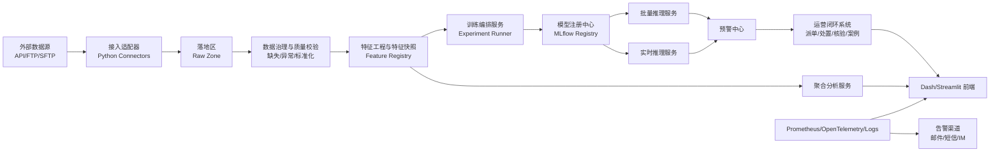
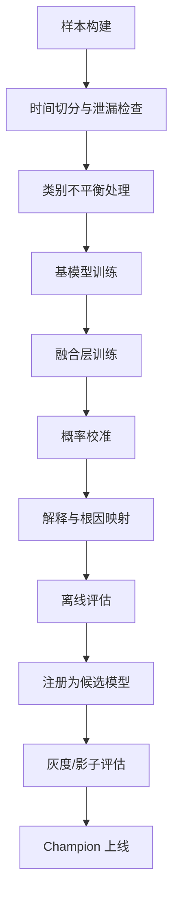
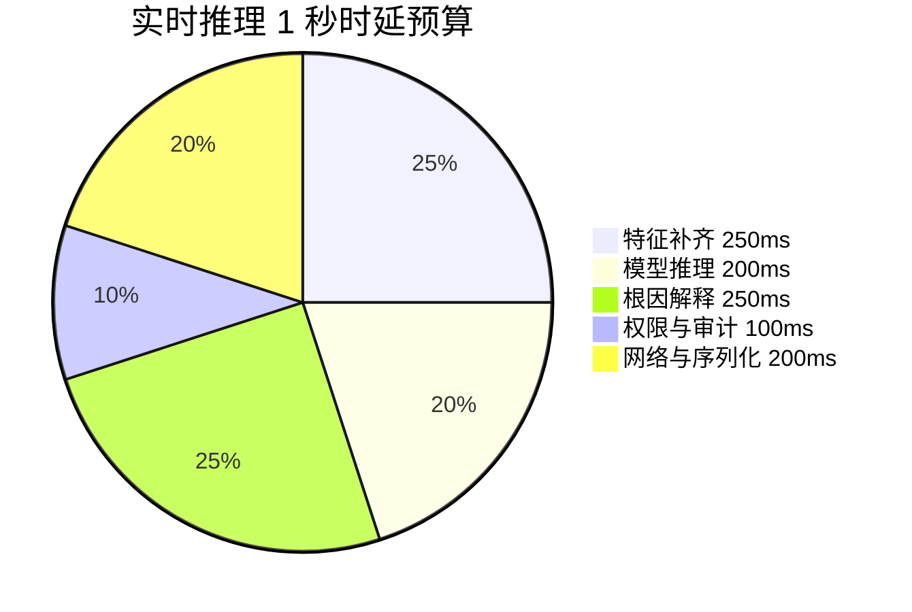
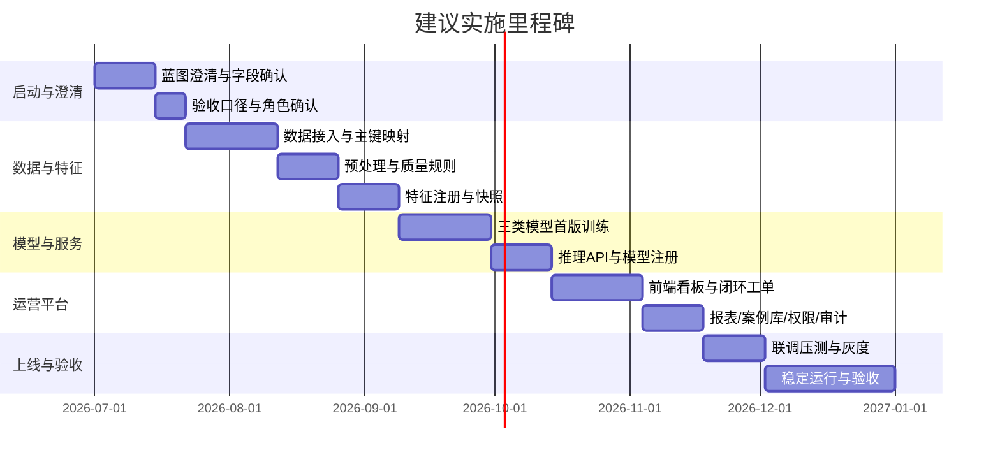

# 基于客户需求文档的AI预测模型系统技术方案

## 执行摘要

本技术方案基于已上传的《AI预测模型开发需求-6.17.docx》整理而成。文档明确了三个主线目标：其一，建设覆盖“数据标注—数据分析—指标监测—指标分析—模型优化—满意度运营”的全流程体系；其二，围绕移网网络不满意用户、移网易受访用户、投诉风险三类模型开展开发与调优；其三，形成满意度运营闭环平台、可视化看板，以及驻场支撑、报告输出和培训交付机制。文档还给出了关键验收指标，例如多源接入、每日处理能力、特征分层、预测准确率、命中率、实时/批量推理时延、多级钻取和闭环处置等。fileciteturn0file0

结合文档目标与约束，推荐采用“**业务逻辑全 Python 化**、**基础设施可插拔**”的实现路线：后端以 FastAPI + Pydantic + SQLAlchemy 为核心，承担 API、数据校验、服务编排和数据库访问；异步任务采用 Celery；大规模数据处理采用 Dask；表格型模型以 XGBoost、LightGBM、CatBoost 为主体；投诉量时序预测采用 PyTorch 实现的 LSTM/Transformer；模型实验与版本管理采用 MLflow；推理环节可按模型类型选择原生 Booster 或 ONNX Runtime；前端优先采用 Dash 构建监控看板，辅以 Streamlit 构建分析与运营工作台。FastAPI 原生支持基于 Python 类型提示的数据验证、自动生成 OpenAPI/Swagger 文档、OAuth2/JWT 安全能力与后台任务模式；Pydantic 适合以类型注解驱动的数据校验与 JSON Schema 生成；SQLAlchemy 提供统一的 ORM/Core 访问模型；Celery 支持任务、周期任务、路由与监控；Dask 适合并行/分布式计算与 TB 级数据处理；MLflow 将实验跟踪、模型打包、注册与部署纳入同一生命周期。citeturn19view2turn19view0turn3view0turn3view1turn3view2turn20view0turn8view0

需要特别说明的是，虽然文档已经提供了较完整的业务目标与验收口径，但仍有一批关键细节未被定义，包括：源数据字段字典、主键规则明细、标签生成口径、具体用户角色矩阵、部署环境与硬件规格、上下游系统接口字段、脱敏级别、预算与工期边界等。因此，以下方案会在**每个模块先列出“假设/未指定项”**，并给出在获得甲方补充文档后如何调整设计的落地路径；凡方案中出现的默认阈值、表结构字段、API 载荷示例，均视为**工程模板**，不是对客户未提供需求的编造。fileciteturn0file0

## 需求解读与未指定项

### 需求基线与系统边界

根据需求文档，平台本质上不是单一模型项目，而是一个兼具**数据治理、特征工程、模型训练、模型部署、运营闭环、可视化、报告输出与组织赋能**的综合系统。文档要求接入六大类数据源，支持 API+FTP 双模式接入，建立“用户—终端—基站—业务”唯一标识关联，支撑日处理量 ≥5TB；构建自动预处理流水线与三级特征体系；完成三类预测模型的训练、部署、监控与迭代；建设满意度运营闭环平台与监控看板；并附带驻场、报告、培训与案例库建设要求。fileciteturn0file0

下表将文档中的核心约束转化为工程基线。

| 主题 | 文档要求 | 工程含义 | 方案影响 |
|---|---|---|---|
| 数据接入 | 6 大类数据源，API+FTP，成功率 ≥99.5% | 必须有统一接入层、重试、幂等与审计 | 采用 Python 适配器 + 接入编排服务 |
| 数据处理 | 每日 ≥5TB、2-4 点完成预处理、≤2 小时 | 需要并行/分布式、增量分区、检查点 | 采用 Dask + 分层存储 |
| 关联识别 | 唯一标识关联准确率 ≥99.9% | 需要 ID 图谱与规则引擎 | 建立主数据映射表与置信度审计 |
| 特征工程 | 基础/衍生/场景三级特征，版本可追溯 | 需要特征注册、快照与回放 | 建立 Feature Registry 与 Snapshot |
| 不满意预测 | XGBoost+LightGBM+CatBoost 融合；批量+实时；准确率 ≥80% | 需要双路径推理与融合策略 | 保留批量与在线两套 Serving |
| 易受访预测 | 0-100 分、5 级钻取、月输出 ≤100 万、命中率 ≥10% | 需要分层聚合、抽样推送与命中反馈 | 增加抽样策略服务 |
| 投诉风险预测 | 分类 + 根因 + 时序预警；准确率 ≥85%；误差 ≤15% | 需要表格模型 + 时序模型并行 | 采用双模型架构 |
| 看板 | 五级钻取、Excel/PDF 导出、5 分钟刷新 | 需要交互式多页前端与报表服务 | 推荐 Dash 主前端 |
| 闭环运营 | 自动派单、效果核验、案例库 ≥500 | 需要任务中心、审计、案例管理 | 增加运营工单域模型 |
| 服务交付 | 驻场、日报/月报/季报/年报、培训 | 不只是代码交付，还要运营交付 | 将报告与培训纳入交付物 | 
| 来源 | 文档第 1-8 页 |  | fileciteturn0file0 |

### 仍未指定事项与补充后如何调整

| 未指定项 | 当前处理方式 | 获得客户补充文档后调整动作 |
|---|---|---|
| 各数据源字段清单、编码表、缺失码 | 先按“适配器 + Schema Registry”设计 | 将 Pydantic Schema、字段映射表和校验规则落表 |
| 标签定义规则 | 先支持规则型 Label Builder | 把标签 SQL/Python 规则固化到版本化配置 |
| 模型训练样本明细 | 先按时间分层 + 业务切分设计 | 根据真实样本偏斜重算 class weight、抽样策略 |
| 用户角色矩阵 | 先按 Admin/Analyst/Operator/Auditor 四类抽象 | 映射至甲方真实组织、地域与条线权限 |
| 生产部署环境 | 提供单机、集群、容器三档 | 按甲方私有云/IDC/国产化环境切换镜像与中间件 |
| 外部系统对接协议 | 先提供 REST/SFTP 双接口模板 | 落地时切换为 MQ、ESB、专线 API 或文件落地 |
| 加密与脱敏边界 | 默认手机号等强脱敏、主键加密索引 | 与法务/安全部门确认等级后细化到字段级 |
| 并发与 SLA | 用文档指标推演默认容量 | 按压测结果调整 worker、缓存与推理切分 |
| 预算与排期 | 给出小/中/大三档估算 | 结合甲方资源、验收节奏重排里程碑 |

在项目启动阶段，应安排一次 **蓝图澄清会**、一次 **字段字典会**、一次 **验收口径会**。只有这三类文档补齐，才能把下面的“模板化方案”转成“上线蓝图”。这一步不是附加项，而是文档落地的必要条件。fileciteturn0file0

## 总体架构与技术选型

### 推荐总体架构

文档同时要求数据治理、三类模型、运营平台和看板闭环，因此不适合做成单体脚本式工程，建议采用“**分层单域、统一 Python 技术栈**”架构：接入层处理外部系统数据导入；数据治理层完成清洗与质量控制；特征层完成特征注册、批计算与快照；模型层完成训练、评估、注册与上线；服务层提供批量/实时推理 API；运营层负责预警、派单、处置、核验、案例库；前端层承载看板、分析与管理。FastAPI 适合作为 API 主框架，Dask 适合处理文档要求的 TB 级数据，XGBoost/LightGBM/CatBoost 适合表格预测场景，PyTorch 适合 LSTM/Transformer 时序建模，ONNX/ONNX Runtime 适合跨框架部署与加速。fileciteturn0file0 citeturn3view3turn20view0turn6view0turn6view1turn6view2turn15academia3turn7view1turn7view2



该架构的关键点不是“服务越多越好”，而是**把变化频繁的业务逻辑写在 Python 域服务中，把可替换的基础设施放在边界处**。这样既满足“纯 Python 实现整个系统”的要求，又能在生产环境中继续使用 PostgreSQL、Redis、对象存储、Docker、Kubernetes 这类成熟基础设施。Docker 的价值在于把容器作为分发、测试和部署单元；Kubernetes 则适合做弹性扩缩容与高可用编排。citeturn10view0turn9view1

### 技术选型比较

#### 前端选型

| 方案 | 推荐等级 | 适用场景 | 优点 | 局限 | 结论 |
|---|---|---|---|---|---|
| Dash + Plotly | 高 | 大屏看板、复杂回调、五级钻取 | 全 Python，天然适合图表与回调式交互 | 表单体验不如传统后台 | **主推荐** |
| Streamlit | 高 | 分析工作台、运营台、标注与审查 | 代码少、迭代快、适合数据团队 | 精细权限与复杂多页面治理需额外封装 | **副推荐** |
| Flask + Jinja | 中 | 传统后台、配置管理、审批页 | 结构清晰，模板化好控 | 图表交互需要额外前端能力 | 可做管理后台 |
| PyWebIO | 中低 | 轻量交互原型、内部工具 | 学习成本低，适合快速搭演示 | 不适合复杂可视化门户 | 仅建议 POC |

Dash 文档强调其 Quickstart、Fundamentals 与 Callbacks 机制，适合以回调驱动复杂交互界面；Streamlit 文档强调只用少量 Python 代码即可构建和部署数据应用；Flask 文档说明其是轻量级 WSGI Web 框架，并依赖 Jinja 模板引擎；PyWebIO 文档则明确其适合不需要复杂 UI 的交互式小型 Web 应用。citeturn5view0turn4view0turn4view2turn5view1

#### 后端与 AI 选型

| 能力域 | 推荐组件 | 选择理由 | 依据 |
|---|---|---|---|
| API 网关与业务服务 | FastAPI | 高性能、类型驱动校验、自动文档、OAuth2/JWT、BackgroundTasks | citeturn3view3turn19view0turn19view2 |
| 数据模型与校验 | Pydantic | 类型注解驱动校验、JSON Schema 输出、严格/宽松模式 | citeturn3view0 |
| ORM/数据库抽象 | SQLAlchemy | 统一 Core/ORM/AsyncIO 模式，便于 SQLite→Postgres 演进 | citeturn3view1 |
| 异步任务 | Celery | 任务、周期任务、路由、监控能力完整 | citeturn3view2 |
| 大规模数据处理 | Dask | Python 原生并行/分布式、支持 DataFrame 与 TB 级数据 | citeturn20view0 |
| 表格型主模型 | XGBoost / LightGBM / CatBoost | 都是成熟 GBDT 家族；LightGBM 高效，CatBoost 对类别特征友好，XGBoost 通用性强 | citeturn6view0turn6view1turn6view2turn13academia2turn14academia1 |
| 时序投诉预测 | PyTorch + LSTM/Transformer | 适合序列建模，并支持 ONNX 导出与性能优化 | citeturn16academia0turn15academia3turn22view1turn22view2 |
| 模型解释 | SHAP | 统一局部解释框架，适合树模型与复杂模型解释 | citeturn7view0turn14academia0 |
| 模型生命周期 | MLflow | 实验跟踪、模型打包、注册与部署 | citeturn8view0 |
| 推理互操作 | ONNX / ONNX Runtime | 跨框架模型表示、运行时加速与硬件适配 | citeturn7view1turn7view2 |
| 观测性 | Prometheus + OpenTelemetry | 适合指标、告警、日志/链路统一观测 | citeturn8view1turn8view2 |

### 面向本项目的两档实现策略

| 档位 | 目标 | 建议栈 | 适用阶段 |
|---|---|---|---|
| 纯 Python 最小闭环 | 快速验收一期能力 | FastAPI + Streamlit + SQLite/Postgres + Celery + XGBoost/LightGBM/CatBoost + PyTorch | POC / 一期上线 |
| 生产增强版 | 满足 5TB/day、三模型、五级钻取、闭环运营 | FastAPI + Dash + PostgreSQL + Redis + Dask + MLflow + ONNX Runtime + Prometheus | 生产正式版 |

如果必须强调“整个系统纯 Python”，建议理解为：**业务代码、界面、API、数据处理、训练、调度、测试均使用 Python**；数据库、中间件、容器平台作为运行基础设施存在，但不承担业务逻辑。这个定义与文档要求并不冲突，也更符合生产系统工程现实。fileciteturn0file0

## 模块化技术方案

### 数据接入与预处理

**假设/未指定项**  
目前文档给出了六大类数据源与同步频率，但未给出字段字典、编码规范、主键定义、失败重传协议、网络专线要求和上游系统鉴权方式。拿到客户补充文档后，应把每个数据源具象化成 `SourceConfig`、`SchemaVersion`、`SyncPolicy` 三类配置。fileciteturn0file0

**需求映射**  
文档要求网络侧、客服侧、用户侧、历史数据、地域数据、场景数据六类接入；支持 API+FTP；接口成功率 ≥99.5%；建立“用户—终端—基站—业务”唯一标识关联且准确率 ≥99.9%；存储采用分布式架构，支持每日 ≥5TB 处理量。预处理则要求缺失值填充、异常剔除、归一化、质量报告、2-4 点窗口内完成且 ≤2 小时，并在异常 15 分钟内告警。fileciteturn0file0

**设计方案**  
建议采用“**接入适配器 + 落地区 + 预处理编排 + 质量规则 + 主数据关联**”的模式。每类数据源配置一个 Python 适配器，统一输出到 Raw Zone；之后由 Dask DataFrame 进行批量清洗和分区写入。Dask 文档明确其 DataFrame 支持并行执行、分布式计算和 terabyte-sized datasets；因此适合承接文档的 5TB/day 指标。预处理策略按文档要求固化：连续特征按同小区均值填充、分类特征按众数填充、时序特征线性插值；异常值采用 3σ + 业务阈值双通道；标准化采用 Min-Max，高基数特征采用目标编码。Dask 只负责并行执行，真正的业务规则仍由 Python 函数库统一封装，保证逻辑可测试、可审计、可回溯。citeturn20view0 fileciteturn0file0

**接口定义**

| 接口 | 方法 | 说明 | 响应要点 |
|---|---|---|---|
| `/api/v1/ingestion/jobs` | POST | 手动触发某数据源同步 | `job_id`、`status`、`source_code` |
| `/api/v1/ingestion/jobs/{job_id}` | GET | 查看同步状态 | 行数、耗时、失败原因、重试次数 |
| `/api/v1/data-quality/reports/{biz_date}` | GET | 获取指定日期质量报告 | 完整性、准确性、一致性评分 |
| `/api/v1/master-linkage/verify` | POST | 触发主键关联校验 | 关联准确率、未匹配清单 |
| `/api/v1/alerts/data-quality` | GET | 查询预处理异常告警 | 规则、级别、处理状态 |

**请求示例**

```json
POST /api/v1/ingestion/jobs
{
  "source_code": "network_kpi_5g",
  "biz_date": "2026-07-01",
  "mode": "scheduled",
  "schema_version": "v1.3"
}
```

**响应示例**

```json
{
  "job_id": "ing_20260701_00031",
  "status": "queued",
  "source_code": "network_kpi_5g",
  "accepted_at": "2026-07-01T02:00:00+08:00"
}
```

**核心数据结构**

| 表名 | 关键字段 | 说明 |
|---|---|---|
| `data_source` | `source_code`, `source_type`, `sync_mode`, `schema_version`, `enabled` | 数据源配置 |
| `ingestion_job` | `job_id`, `source_code`, `biz_date`, `status`, `rows_in`, `rows_out`, `error_msg` | 接入任务审计 |
| `master_identity_map` | `user_id`, `device_id`, `cell_id`, `service_id`, `confidence`, `valid_from`, `valid_to` | 唯一标识关系图 |
| `data_quality_report` | `biz_date`, `dataset`, `completeness_score`, `accuracy_score`, `consistency_score`, `issues` | 数据质量日报 |

**性能优化策略**  
大表按 `biz_date/region/source_code` 分区；接入作业幂等化；FTP 文件落地后先计算 checksum；Dask 任务按数据源并行；质量规则拆为轻重两层，轻校验在导入时执行，重校验在预处理批次时执行；主数据图谱采用“规则优先 + 置信度评分”以提升 99.9% 关联准确率目标的可验证性。fileciteturn0file0 citeturn20view0

**容错与扩展**  
接入失败支持指数退避重试；每个数据源单独熔断；落地文件采用“原始区只追加、不覆盖”策略；清洗任务失败可从上一个 checkpoint 重跑；后续若甲方要求 MQ 接入，可在适配器层新增 Kafka/RabbitMQ Connector，而不影响下游特征与模型层。Celery 的 periodic tasks、routing tasks 与 monitoring guide 适合支撑这里的调度、分队列与运行监控。citeturn3view2

### 特征工程

**假设/未指定项**  
文档给出了基础特征 86 个、衍生特征 132 个、场景特征 50 个，但没有给出具体字段与计算公式，也未说明“相关性 ≥0.3”采用何种统计口径。拿到补充文件后，应将每个特征定义为：语义、口径、SQL/Python 表达式、更新频率、依赖字段、可解释标签、是否用于线上推理。fileciteturn0file0

**需求映射**  
文档要求构建三级特征体系，支持特征自动计算、SHAP 重要性分析、冗余特征剔除、版本管理与历史回溯；更新频率分别为小时级、日级、周级。fileciteturn0file0

**设计方案**  
建议建设一个轻量的 **Feature Registry**，由以下部分组成：`feature_definition` 存口径，`feature_materialization_job` 存计算调度，`feature_snapshot` 存某日期/某版本的真实落地值。衍生特征和场景特征统一用 Python 函数注册器管理，避免把复杂逻辑散落在 SQL 脚本中。SHAP 文档与原始论文都指出其可以为单次预测分配特征重要性，是较适合本项目“TOP3 根因输出”的解释框架。citeturn7view0turn14academia0

**接口定义**

| 接口 | 方法 | 说明 |
|---|---|---|
| `/api/v1/features/definitions` | POST | 新增/更新特征口径 |
| `/api/v1/features/snapshots/materialize` | POST | 触发特征快照计算 |
| `/api/v1/features/snapshots/{snapshot_id}` | GET | 查询快照元数据 |
| `/api/v1/features/importance/{model_version}` | GET | 查询 SHAP / 全局重要性 |
| `/api/v1/features/redundancy/check` | POST | 触发冗余特征分析 |

**数据结构**

| 表名 | 关键字段 | 说明 |
|---|---|---|
| `feature_definition` | `feature_code`, `layer`, `expr_type`, `update_freq`, `owner`, `version` | 特征定义库 |
| `feature_snapshot` | `snapshot_id`, `biz_date`, `entity_type`, `entity_id`, `feature_code`, `value`, `feature_version` | 特征值快照 |
| `feature_materialization_job` | `job_id`, `layer`, `biz_date`, `status`, `runtime_sec` | 物化任务 |
| `feature_importance_report` | `model_version`, `feature_code`, `importance_score`, `method`, `biz_date` | 特征重要性 |

**关键算法/候选方法**  
冗余特征剔除建议分三层：先做缺失率/唯一值率/方差过滤；再做相关性或互信息筛选；最后在模型层结合 SHAP 或树模型 gain 去掉低贡献特征。对高基数类别特征，文档指定目标编码，可在训练端做 K-fold target encoding，在线端则使用已冻结映射，防止泄漏。CatBoost 文档本身对 categorical features 有较强支持，因此对于包含大量类别型信号的模型，可优先保留 CatBoost 支路。fileciteturn0file0 citeturn6view2

**容错与扩展**  
特征口径一旦发布即进入版本化；线上推理只读“已发布”版本；历史回放时按 `feature_version + snapshot_date` 精确重建；如果今后甲方新增地域专属特征，如新气象因子或地理网格编码，只需要新增 `feature_definition` 与 materializer，不需要改动模型服务接口。fileciteturn0file0

### 模型训练与验证

**假设/未指定项**  
文档明确了三类模型与部分算法方向，但未明确训练周期边界、标签延迟、样本去重规则、线上概率校准方式和根因标签是否可监督学习。因此本方案采用“**文档要求为硬约束，细节采用可替换模板**”的处理方法。fileciteturn0file0

**三类模型的推荐建模框架**

| 模型 | 文档要求 | 推荐实现 | 默认标签与输出 | 核心评估指标 |
|---|---|---|---|---|
| 移网网络不满意用户预测 | XGBoost + LightGBM + CatBoost 融合；批量+实时；准确率 ≥80%；TOP3 根因 | 三模型 stacking / weighted blending；概率校准；SHAP + 规则根因映射 | 输出概率、风险等级、高中低预警、TOP3 根因 | Accuracy、Recall、F1、AUC、Calibration、月波动 |
| 移网易受访用户预测 | XGBoost + LightGBM + LR 三层融合；0-100 分；五级钻取；命中率 ≥10% | 双塔结构没有必要；建议树模型 + LR calibration 形成标准分 | 输出标准化分数、分层名单、抽样建议 | Hit Rate、Top-K Precision、Coverage、分层稳定性 |
| 投诉风险预测 | 分类预测 + 根因诊断 + 时序预警；未来 7 天投诉概率；LSTM + Transformer；准确率 ≥85%，召回 ≥80%，时序误差 ≤15% | 用户级分类模型 + 区县/网格级 seq2seq 时序模型 + 区域聚合预警器 | 输出 7 天投诉概率、风险等级、区域趋势、72 小时批量预警 | Accuracy、Recall、F1、MAE/MAPE/WAPE、预警提前量 |

文档给出的树模型选型与分层目标本身非常适合 GBDT 家族：XGBoost 是面向高效、灵活与可扩展的梯度提升系统；LightGBM 强调更快训练、较低内存和分布式能力；CatBoost 则强调对类别特征的处理与 ordered boosting；SHAP 适合把这些模型的结果解释成用户或区域级根因。对投诉量时序预警，LSTM 擅长处理长短期依赖；Transformer 则在并行化与注意力建模方面具备明显优势。fileciteturn0file0 citeturn13academia2turn6view1turn14academia1turn14academia0turn16academia0turn15academia3

**训练流程**



**训练与验证设计**  
不满意用户模型按文档的 1:4 样本比例与 7:3 训练/测试集要求执行，但建议在此基础上再加一个**按时间滚动的验证集**，避免随机切分带来信息泄漏。易受访模型建议把“调研命中/未命中”作为迟到标签回流，通过月度增量迭代更新抽样策略。投诉风险模型应拆成两条训练链：第一条是用户级分类链，使用 GBDT；第二条是区域级时序链，使用 LSTM/Transformer。这样做是因为“用户是否投诉”和“某区县未来 7 天投诉量走势”本质上不是同一个学习任务。fileciteturn0file0

**建议超参数起点**

| 模型 | 超参数起点 | 备注 |
|---|---|---|
| XGBoost | `max_depth=6`, `eta=0.05`, `subsample=0.8`, `colsample_bytree=0.8`, `n_estimators=500` | 适合做稳健主模型 |
| LightGBM | `num_leaves=64`, `learning_rate=0.05`, `feature_fraction=0.8`, `bagging_fraction=0.8`, `n_estimators=800` | 更偏效率 |
| CatBoost | `depth=8`, `learning_rate=0.05`, `loss_function=Logloss`, `eval_metric=AUC` | 类别特征友好 |
| LR 校准层 | `C=1.0`, `penalty=l2` | 用于分数标准化 |
| LSTM | `hidden_size=128`, `num_layers=2`, `dropout=0.2`, `seq_len=28` | 区域投诉量基线 |
| Transformer | `d_model=128`, `nhead=4`, `num_layers=2`, `dropout=0.1` | 时序增强支路 |

这些数值不是“客户要求”，而是便于启动实验的**默认起点**。XGBoost、LightGBM、CatBoost 都提供了参数与调优文档；PyTorch 教程也给出了 DataLoader 优化、`torch.compile` 与 ONNX 导出的生产实践入口。citeturn6view0turn6view1turn6view2turn22view0turn22view2turn22view1

**评估指标设计**  
除了文档指定的 Accuracy、Recall、F1、命中率、时序误差，还应补充：AUC-ROC、PR-AUC、Top-K Precision、Brier Score/Calibration、PSI/CSI 漂移指标、分地域稳定性。理由是该系统最终要承担“运营决策”，不是只出一个分类结果；因此如果概率不校准、地域间差异不稳，运营闭环会失真。Scikit-learn 文档将 model selection、cross validation 和 metrics 作为核心能力域，适合承担这一层的统一评估封装。citeturn11view1

**性能优化与容错**  
对树模型，优先使用批量向量化推理、预先编码特征、按地域并行分片；对深度时序模型，使用混合精度、DataLoader 优化、必要时使用 `torch.compile`。PyTorch 教程明确提供了数据加载优化与 `torch.compile` 性能提升路径。上线前采用 champion/challenger 机制，确保每月迭代不必直接替换线上模型。citeturn22view0turn22view2

### 模型管理与版本控制

**假设/未指定项**  
文档要求特征与模型可版本管理，但未明确审批流程、回滚流程与灰度规则。当前默认采用“实验版本 → 候选版本 → 已发布版本 → 已回退版本”的状态机。fileciteturn0file0

**设计方案**  
MLflow 文档将 experiment tracking、model packaging、registry management 和 deployment 组织在同一传统 ML 生命周期中，因此非常适合作为该项目的模型管理中枢。每个模型版本应绑定：训练数据快照 ID、特征版本、代码 commit、超参数、离线指标、解释报告、上线审批记录。citeturn8view0

**接口定义**

| 接口 | 方法 | 说明 |
|---|---|---|
| `/api/v1/models/train` | POST | 创建训练任务 |
| `/api/v1/models/versions/{model_version}` | GET | 查询版本详情 |
| `/api/v1/models/versions/{model_version}/promote` | POST | 提升为候选/生产 |
| `/api/v1/models/versions/{model_version}/rollback` | POST | 回滚版本 |
| `/api/v1/models/monitoring/{model_name}` | GET | 查看线上指标与漂移 |

**模型注册表建议字段**

| 字段 | 说明 |
|---|---|
| `model_name` | `dissatisfaction`, `survey`, `complaint_cls`, `complaint_ts` |
| `model_version` | 语义化版本，如 `1.4.2` |
| `dataset_snapshot` | 训练数据快照 ID |
| `feature_version` | 特征版本 |
| `algorithm_stack` | XGBoost/LightGBM/CatBoost/LSTM/Transformer |
| `metrics_json` | 离线评估结果 |
| `artifact_uri` | 模型文件位置 |
| `approval_status` | draft/candidate/prod/rollback |
| `deployed_env` | test/staging/prod |
| `release_note` | 变更说明 |

**扩展策略**  
后续若客户要求“多省份模型”或“分城市子模型”，只需在注册表中增加 `scope_type` 与 `scope_code`，不破坏既有生命周期。文档要求“每月至少 1 次参数迭代、季度全量重构”时，也可以通过这一注册机制固化。fileciteturn0file0

### 推理服务与 API

**假设/未指定项**  
文档明确了批量预测与实时预测的目标，但未提供实时事件触发来源、调用频率和上游接口规范。暂按“外部质差事件触发单用户实时评分，内部调度触发批量评分”设计。fileciteturn0file0

**设计方案**  
推理层拆为两类服务。其一是批处理服务：每日凌晨对全量用户或候选用户评分，并生成预警名单；其二是实时服务：接收单用户或小批量事件流，在 1 秒内返回风险分、等级与根因摘要。FastAPI 适合暴露 JSON API，Pydantic 适合约束输入输出，FastAPI 自动生成 Swagger/ReDoc 文档，便于甲方联调。fileciteturn0file0 citeturn19view2turn3view0

**核心 API 规范**

| 接口 | 方法 | SLA 目标 | 用途 |
|---|---|---|---|
| `/api/v1/predict/dissatisfaction/realtime` | POST | P95 < 1s | 质差事件触发单用户评分 |
| `/api/v1/predict/dissatisfaction/batch` | POST | 10 万用户批次目标 ≤10s | 批量预测 |
| `/api/v1/predict/survey/batch` | POST | 5 分钟内完成增量打分 | 易受访名单生成 |
| `/api/v1/predict/complaint/user` | POST | P95 < 1s | 用户未来 7 天投诉概率 |
| `/api/v1/predict/complaint/region-trend` | POST | <15 分钟 | 区县/网格未来 7 天走势 |
| `/api/v1/alerts/tasks` | POST | 异步 | 预警转工单 |
| `/api/v1/reports/export` | POST | 异步 | Excel/PDF 导出 |

**请求示例**

```json
POST /api/v1/predict/dissatisfaction/realtime
{
  "user_id": "U98327461",
  "event_time": "2026-07-01T10:02:11+08:00",
  "region_code": "440300",
  "features": {
    "rsrp_avg_1h": -113.2,
    "handover_fail_cnt_24h": 7,
    "complaint_cnt_30d": 1,
    "arpu": 129.0,
    "terminal_brand": "X"
  }
}
```

**响应示例**

```json
{
  "request_id": "pred_rt_20260701100211991",
  "model_version": "dissatisfaction-1.4.2",
  "risk_score": 0.81,
  "risk_level": "high",
  "top_causes": [
    {"code": "coverage", "name": "覆盖不足", "contribution": 0.26},
    {"code": "handover", "name": "切换异常", "contribution": 0.19},
    {"code": "interference", "name": "干扰增强", "contribution": 0.11}
  ],
  "decision_time_ms": 136
}
```

**实时推理 1 秒预算示意**



**性能优化策略**  
树模型在线服务优先保留原生 Booster 推理，因为表格型推理通常已足够快；若某些模型转换稳定，可导出 ONNX，由 ONNX Runtime 进行统一运行时管理。ONNX 主页强调其用于模型互操作，ONNX Runtime 文档则强调其可作为跨平台 model accelerator，并支持来自 PyTorch、TensorFlow/Keras、scikit-learn 等框架的模型。对深度时序模型，则优先走 ONNX Runtime 或 PyTorch 编译优化路径。citeturn7view1turn7view2turn22view1turn22view2

**容错与扩展**  
实时服务设置本地特征缓存与降级策略：如果个别次要特征缺失，使用最近快照值或默认值继续打分，并在响应中标记 `degraded=true`；如果模型服务异常，则回退到上一稳定版本；如果根因解释超时，则先返回风险分，再异步补发解释结果。这样可以避免“为了完整解释牺牲实时 SLA”。这类降级策略是工程推断，但与文档对实时响应不超过 1 秒的约束完全一致。fileciteturn0file0

### 前端 UI 与可视化

**假设/未指定项**  
文档要求一站式看板与五级钻取，但未明确角色首页差异、屏幕尺寸规范、是否要兼容手机或国产浏览器。当前默认面向桌面内网浏览器，主角色为运营分析、区域经理和管理员。fileciteturn0file0

**需求映射**  
文档要求模型性能监控区、预测结果监控区、闭环处置监控区、业务成效监控区；支持五级钻取、Excel/PDF 导出、实时指标 5 分钟刷新、日指标 9 点更新。fileciteturn0file0

**设计方案**  
建议使用 **Dash** 作为正式看板前端，原因是其回调机制更适合五级钻取、复杂筛选联动与大屏布局；同时使用 **Streamlit** 提供分析工作台，用于样本检索、模型解释、案例复盘和临时报表。Streamlit 文档强调其适合快速交付数据应用；Dash 则以内建回调和组件化图表见长。citeturn4view0turn5view0

**页面/组件清单**

| 页面 | 组件 | 主要能力 |
|---|---|---|
| 首页总览 | KPI 卡片、时间筛选、地域钻取、趋势图 | 展示三大模型与整体运营指标 |
| 不满意用户监控 | 概率分布图、风险地图、根因排行、用户明细表 | 高中低风险用户看板 |
| 易受访运营 | 分层名单、抽样策略面板、命中率趋势、推送日志 | 抽样与反馈闭环 |
| 投诉风险预警 | 区县/网格趋势图、72 小时预警列表、根因分类图 | 时序预警与区域联动 |
| 闭环任务中心 | 工单列表、责任人、超时提醒、核验结果 | 任务派发与处置跟踪 |
| 案例库 | 标签筛选、相似案例、处理建议 | 沉淀 500+ 典型案例 |
| 报表中心 | 日报/月报/季报/专题导出 | Excel/PDF 导出 |
| 管理中心 | 数据源配置、特征版本、模型版本、权限管理 | 系统治理 |

**前端交互流程**


**前端示例代码**

```python
# Dash：五级钻取示意
from dash import Dash, dcc, html, Input, Output
import plotly.express as px
import pandas as pd

app = Dash(__name__)

app.layout = html.Div([
    dcc.Dropdown(id="level", options=[
        {"label": "全省", "value": "province"},
        {"label": "地市", "value": "city"},
        {"label": "区县", "value": "county"},
        {"label": "网格", "value": "grid"},
        {"label": "基站", "value": "cell"},
    ], value="city"),
    dcc.Graph(id="risk-chart")
])

@app.callback(
    Output("risk-chart", "figure"),
    Input("level", "value")
)
def update_chart(level: str):
    df = pd.DataFrame({
        "name": ["A", "B", "C"],
        "risk_users": [1200, 900, 1500]
    })
    return px.bar(df, x="name", y="risk_users", title=f"{level} 维度风险用户分布")

if __name__ == "__main__":
    app.run(debug=True)
```

```python
# Streamlit：用户级根因查看示意
import streamlit as st
import pandas as pd

st.title("用户风险解释工作台")
user_id = st.text_input("输入用户ID", value="U98327461")

if st.button("查询"):
    result = {
        "risk_score": 0.81,
        "risk_level": "high",
        "causes": [
            ("覆盖不足", 0.26),
            ("切换异常", 0.19),
            ("干扰增强", 0.11),
        ]
    }
    st.metric("风险分", result["risk_score"])
    st.write("风险等级：", result["risk_level"])
    st.dataframe(pd.DataFrame(result["causes"], columns=["根因", "贡献度"]))
```

### 认证与权限

**假设/未指定项**  
文档没有给出统一认证方式、是否接企业 AD/LDAP、是否有省市县分权治理要求。当前默认：账号体系可本地维护，也可对接企业 SSO。fileciteturn0file0

**设计方案**  
FastAPI 文档列出了 OAuth2 with Password and Bearer、JWT tokens、安全依赖与作用域能力，因此推荐采用 **OAuth2 + JWT + RBAC/ABAC 混合授权**。其中 RBAC 控角色，ABAC 控地域与数据范围，例如“市级用户只能查看本市及下属区县数据”。citeturn19view0

**权限模型建议**

| 角色 | 典型权限 |
|---|---|
| 平台管理员 | 数据源配置、模型发布、权限管理、审计查看 |
| 模型工程师 | 训练、评估、注册、灰度、监控 |
| 运营分析师 | 看板、下钻、报表、案例管理 |
| 一线处置人员 | 仅查看分派给自己的预警任务 |
| 审计员 | 只读访问审计、日志与报表 |

**认证接口**

| 接口 | 方法 | 说明 |
|---|---|---|
| `/api/v1/auth/token` | POST | 获取访问令牌 |
| `/api/v1/auth/refresh` | POST | 刷新令牌 |
| `/api/v1/users/me` | GET | 当前用户信息与权限范围 |
| `/api/v1/admin/roles` | GET/POST | 角色配置 |
| `/api/v1/admin/policies` | GET/POST | 数据权限策略 |

**扩展说明**  
如果后续甲方明确要求国密、双因子或统一门户，可把 JWT 签发放到网关或企业身份中心，业务服务只消费权限声明，不需要推倒重做。citeturn19view0

### 日志与监控

**假设/未指定项**  
文档要求模型监控、数据质量告警与闭环处置监控，但未明确要不要链路追踪、APM、集中日志平台。当前建议默认具备结构化日志、指标监控、链路追踪三级能力。fileciteturn0file0

**设计方案**  
Prometheus 适合做 time-series 指标采集与告警；OpenTelemetry 适合统一 traces、metrics、logs 语义；FastAPI/Celery/Dask 均可通过 Python 客户端上报。Prometheus 官方说明其以时间序列方式采集和存储指标，支持告警与可视化；OpenTelemetry 提供 traces、metrics、logs 等观测信号语义。citeturn8view1turn8view2

**建议监控指标**

| 类别 | 关键指标 |
|---|---|
| 接入层 | 接口成功率、文件到达延迟、重试次数、落地耗时 |
| 数据层 | 完整性分、准确性分、一致性分、坏数据占比 |
| 训练层 | 训练时长、数据版本、离线指标、资源利用率 |
| 推理层 | QPS、P95/P99 时延、超时率、降级率 |
| 模型层 | Accuracy/Recall/F1、Hit Rate、MAPE、漂移 PSI |
| 业务层 | 预警数量、处置完成率、平均处置时长、核验通过率 |
| 平台层 | CPU、内存、磁盘、队列积压、数据库连接数 |

**告警规则示例**  
数据质量分 <95 立即告警；实时推理 P95 >800ms 连续 5 分钟告警；当月命中率预测低于 10% 基线触发分析任务；投诉趋势模型 MAPE 连续一周 >15% 触发模型重训候选。前两项直接对应文档验收要求，后两项是对文档指标的运维化转译。fileciteturn0file0

### CI/CD 与部署

**假设/未指定项**  
文档没有给出甲方是本地 IDC、私有云还是混合云，也没有给出是否允许公网镜像仓库、是否使用 GitHub/GitLab/Jenkins。当前以“容器化交付、内网仓库、标准流水线”设计。fileciteturn0file0

**设计方案**  
以 Docker 容器为交付单元；测试环境单机 Compose 即可；生产环境建议 Kubernetes。Docker 文档指出容器是开发、测试、分发和部署应用的统一单元；Kubernetes 则提供节点/工作负载层面的扩缩容能力。CI/CD 流水线建议至少包含：静态检查、单元测试、集成测试、镜像构建、镜像扫描、部署到 staging、冒烟测试、审批发布。GitHub Actions 文档覆盖了 workflow syntax、secrets、job、container、deployment 等核心能力。citeturn10view0turn9view1turn10view1

**部署分层**

| 环境 | 组件 | 目标 |
|---|---|---|
| Dev | FastAPI、Dash/Streamlit、SQLite/本地 Postgres、Celery eager | 快速开发 |
| Test/Staging | FastAPI、Dash、Postgres、Redis、Celery、Dask LocalCluster | 集成联调 |
| Prod | FastAPI 多副本、Dash 多副本、Postgres 主从、Redis、Celery Worker、Dask Cluster、Prometheus/Grafana | 正式上线 |

### 测试与验收

**假设/未指定项**  
文档给出了验收结果指标，但没有给出测试数据规模、压测工具、A/B 人群切分方式和 UAT 流程。当前按行业常见流程提供模板。fileciteturn0file0

**设计方案**  
测试分为五层：单元测试、集成测试、数据质量测试、性能测试、业务验收测试。Pytest 文档强调其适合从小而清晰的测试扩展到复杂功能测试，并提供 fixtures、参数化、自动发现等能力，因此可作为统一测试框架。citeturn9view0

**验收对照表**

| 模块 | 文档验收要点 | 建议验收方法 |
|---|---|---|
| 数据接入 | 全部接入完成、成功率达标、延迟达标 | 30 天接入日报 + 审计日志抽查 |
| 预处理 | 30 天稳定运行、质量分达标、告警有效 | 定时任务成功率 + 告警回放 |
| 特征工程 | 三级体系完成、相关性达标、计算正常 | 特征报告 + 抽样校验 |
| 不满意预测 | 连续 3 个月准确率达标 | 月度离线/在线一致性报表 |
| 易受访预测 | 连续 3 个月命中率达标 | 调研回流命中统计 |
| 投诉风险 | 连续 3 个月准确率/召回率达标、时序预警正常 | 分类与时序双报表 |
| 闭环系统 | 派单、核验、案例库达标 | 业务演练 + 用例验收 |
| 看板 | 数据准确、钻取与导出正常 | UAT 脚本逐项打勾 |

## 前端纯 Python 实现细化

### 建议的前端双形态

对于本项目，前端不建议“一把锤子打所有钉子”。更实用的做法是：**正式运营大屏与复杂钻取看板用 Dash；分析、排障、案例回顾、模型解释工作台用 Streamlit**。这样既能保证一期快速交付，又不会牺牲二期复杂交互能力。Dash 更适合强布局和回调联动；Streamlit 更适合数据团队和运营团队快速自助分析。citeturn5view0turn4view0

### 页面与组件蓝图

| 页面 | 组件清单 | 数据来源 | 交互逻辑 |
|---|---|---|---|
| 总控大屏 | KPI 卡片、地图、趋势折线、筛选器、异常播报 | 聚合 API | 自动刷新 + 下钻 |
| 模型监测页 | 准确率/召回率/F1 趋势、迭代次数、漂移图 | 监控 API | 切换模型版本对比 |
| 预测结果页 | 风险人数、根因分布、用户明细表、导出按钮 | 推理结果 API | 支持地域 + 时间双筛选 |
| 闭环管理页 | 工单列表、责任人、状态流转、核验结果 | 运营 API | 支持催办与超时提醒 |
| 案例库页 | 标签搜索、相似案例、典型处置方案 | 案例 API | 标签组合查询 |
| 报表中心 | 日报/月报模板、导出任务列表 | 报表 API | 异步导出下载 |
| 系统配置页 | 数据源、特征、模型、权限 | 管理 API | 受管理员权限控制 |

### 典型交互流程

例如“从大屏发现高风险区域 → 下钻到网格 → 查看高风险用户 → 查看 SHAP 根因 → 生成预警工单 → 追踪处置 → 复盘为案例”，整个过程都不需要离开 Python 前端体系。这里推荐把业务状态保存在后端数据库，浏览器仅保留短期会话状态，避免前端状态逻辑过重。fileciteturn0file0

### 前端工程结构建议

```text
frontend/
├── dash_app/
│   ├── app.py
│   ├── pages/
│   │   ├── overview.py
│   │   ├── dissatisfaction.py
│   │   ├── survey.py
│   │   ├── complaint.py
│   │   ├── operations.py
│   │   └── reports.py
│   ├── components/
│   │   ├── kpi_cards.py
│   │   ├── region_filter.py
│   │   ├── charts.py
│   │   └── tables.py
│   └── services/
│       └── api_client.py
└── streamlit_app/
    ├── Home.py
    ├── pages/
    │   ├── 01_用户解释.py
    │   ├── 02_样本检索.py
    │   ├── 03_案例复盘.py
    │   └── 04_临时报表.py
    └── lib/
        └── backend_client.py
```

### 前端代码风格建议

Dash 页面只做“布局 + 回调”，不要在页面文件中直接写 SQL 或复杂业务逻辑；所有图表数据都从后端聚合 API 读取。Streamlit 页面应该复用后端 API，不要形成“第二套直连数据库的逻辑”，否则权限和审计会失控。这是该类系统后期最常见的技术债之一。fileciteturn0file0

## 后端纯 Python 实现细化

### 服务拆分建议

建议采用以下 Python 服务边界：

| 服务 | 核心职责 | 推荐框架 |
|---|---|---|
| `gateway-service` | API 入口、鉴权、限流、OpenAPI 文档 | FastAPI |
| `ingestion-service` | 数据接入、落地、任务审计 | FastAPI + Celery |
| `feature-service` | 特征计算、快照、查询 | FastAPI + Dask |
| `training-service` | 训练编排、评估、注册 | FastAPI + Celery + MLflow |
| `inference-service` | 批量/实时推理 | FastAPI |
| `ops-service` | 预警任务、派单、核验、案例库 | FastAPI |
| `report-service` | 日报/月报导出 | FastAPI + Celery |
| `frontend-service` | Dash/Streamlit 前端应用 | Dash / Streamlit |

FastAPI 适合做服务间统一协议层，因为其在一次类型声明中即可完成请求/响应校验、自动文档和错误返回；Pydantic 负责严格的载荷建模；SQLAlchemy 负责 ORM；Celery 负责异步训练、批推理和导出。citeturn19view2turn3view0turn3view1turn3view2

### 后端数据库表设计

下表给出核心生产表，不含所有维表与审计明细表。

| 表名 | 主键 | 关键字段 | 用途 |
|---|---|---|---|
| `user_account` | `user_id` | `username`, `display_name`, `status`, `tenant_code` | 登录账号 |
| `role_binding` | `id` | `user_id`, `role_code`, `scope_type`, `scope_code` | 角色与数据范围 |
| `audit_log` | `audit_id` | `actor`, `action`, `resource`, `payload_digest`, `created_at` | 审计日志 |
| `data_source` | `source_code` | `sync_mode`, `schema_version`, `watermark` | 数据源配置 |
| `ingestion_job` | `job_id` | `source_code`, `biz_date`, `status`, `rows_in`, `rows_out` | 接入任务 |
| `data_quality_report` | `id` | `dataset`, `biz_date`, `scores_json`, `issues_json` | 质量报告 |
| `feature_definition` | `feature_code` | `layer`, `version`, `expr`, `update_freq` | 特征定义 |
| `feature_snapshot` | `id` | `entity_type`, `entity_id`, `feature_code`, `biz_date`, `value` | 特征快照 |
| `label_snapshot` | `id` | `label_name`, `entity_id`, `biz_date`, `label_value` | 标签快照 |
| `experiment_run` | `run_id` | `model_name`, `params_json`, `metrics_json`, `artifact_uri` | 训练实验 |
| `model_registry` | `id` | `model_name`, `model_version`, `status`, `dataset_snapshot`, `feature_version` | 模型注册 |
| `model_deployment` | `deploy_id` | `model_version`, `env`, `traffic_ratio`, `effective_at` | 部署记录 |
| `prediction_result` | `pred_id` | `model_name`, `model_version`, `entity_id`, `score`, `level`, `cause_json` | 预测结果 |
| `alert_event` | `alert_id` | `alert_type`, `severity`, `scope_code`, `source_pred_id`, `status` | 预警事件 |
| `operation_task` | `task_id` | `alert_id`, `assignee`, `status`, `deadline`, `verify_result` | 闭环工单 |
| `case_library` | `case_id` | `tags`, `summary`, `root_cause`, `action_taken`, `effect_score` | 案例库 |
| `report_job` | `job_id` | `report_type`, `biz_date`, `status`, `file_uri` | 导出任务 |

### Pydantic 与 FastAPI 示例

```python
from datetime import datetime
from typing import Literal, List
from fastapi import FastAPI, Depends
from pydantic import BaseModel, Field

app = FastAPI(title="AI Prediction Platform")

class CauseItem(BaseModel):
    code: str
    name: str
    contribution: float = Field(ge=0, le=1)

class RealtimePredictRequest(BaseModel):
    user_id: str
    event_time: datetime
    region_code: str
    features: dict

class RealtimePredictResponse(BaseModel):
    request_id: str
    model_version: str
    risk_score: float
    risk_level: Literal["high", "medium", "low"]
    top_causes: List[CauseItem]

@app.post("/api/v1/predict/dissatisfaction/realtime",
          response_model=RealtimePredictResponse)
def predict_realtime(req: RealtimePredictRequest):
    return RealtimePredictResponse(
        request_id="pred_demo_001",
        model_version="dissatisfaction-1.4.2",
        risk_score=0.81,
        risk_level="high",
        top_causes=[
            CauseItem(code="coverage", name="覆盖不足", contribution=0.26),
            CauseItem(code="handover", name="切换异常", contribution=0.19),
            CauseItem(code="interference", name="干扰增强", contribution=0.11)
        ]
    )
```

FastAPI 对基于类型提示的请求体与响应模型约束、自动文档、嵌套 JSON 校验有直接支持；Pydantic 则适合生成 JSON Schema 并进行严格模型校验。citeturn19view2turn3view0

### 异步任务与调度方案

文档要求定时预处理、月度模型迭代、每日批量预测、报表输出、5 分钟刷新与预警任务派发，因此后端必须有统一异步任务层。建议：

| 任务类型 | 方案 | 说明 |
|---|---|---|
| 夜间预处理 | Celery Beat 定时触发 + Dask 执行 | 2-4 点窗口运行 |
| 日批特征物化 | Celery DAG 编排 | 依赖上游接入完成信号 |
| 模型训练 | Celery 长任务队列 | GPU/CPU 队列隔离 |
| 批量推理 | Celery + 分片 worker | 按地域或用户分片 |
| 报表导出 | Celery 异步文件生成 | 避免阻塞前端 |
| 命中率回流 | 周期任务 | 每日更新反馈标签 |
| 漂移监控 | 周期任务 | 每小时/每日运行 |

```python
# Celery 任务示意
from celery import Celery

celery_app = Celery(
    "ai_platform",
    broker="redis://redis:6379/0",
    backend="redis://redis:6379/1"
)

@celery_app.task(bind=True, autoretry_for=(Exception,), retry_backoff=True, max_retries=5)
def run_daily_feature_job(self, biz_date: str):
    # 1. 读取清洗后数据
    # 2. 物化基础/衍生/场景特征
    # 3. 写入 feature_snapshot
    return {"biz_date": biz_date, "status": "success"}
```

Celery 文档明确包含 tasks、periodic tasks、routing tasks、workers guide 和 monitoring/management guide，这正对应本项目的异步任务编排需要。citeturn3view2

### 模型训练代码骨架

```python
from sklearn.linear_model import LogisticRegression
from sklearn.metrics import roc_auc_score, f1_score
from xgboost import XGBClassifier
from lightgbm import LGBMClassifier
from catboost import CatBoostClassifier
import numpy as np

class DissatisfactionEnsemble:
    def __init__(self):
        self.xgb = XGBClassifier(max_depth=6, learning_rate=0.05, n_estimators=500)
        self.lgb = LGBMClassifier(num_leaves=64, learning_rate=0.05, n_estimators=800)
        self.cat = CatBoostClassifier(depth=8, learning_rate=0.05, verbose=False)
        self.meta = LogisticRegression(max_iter=500)

    def fit(self, X_train, y_train, X_valid, y_valid):
        self.xgb.fit(X_train, y_train)
        self.lgb.fit(X_train, y_train)
        self.cat.fit(X_train, y_train)

        meta_X = np.column_stack([
            self.xgb.predict_proba(X_valid)[:, 1],
            self.lgb.predict_proba(X_valid)[:, 1],
            self.cat.predict_proba(X_valid)[:, 1],
        ])
        self.meta.fit(meta_X, y_valid)

    def predict_proba(self, X):
        meta_X = np.column_stack([
            self.xgb.predict_proba(X)[:, 1],
            self.lgb.predict_proba(X)[:, 1],
            self.cat.predict_proba(X)[:, 1],
        ])
        return self.meta.predict_proba(meta_X)[:, 1]
```

这类实现与文档中的融合要求相吻合，但上线前仍需加上时间切分、概率校准、模型解释和版本化封装。XGBoost、LightGBM、CatBoost 分别提供了 Python API、参数文档与分类/回归使用路径。fileciteturn0file0 citeturn6view0turn6view1turn6view2

## 安全合规与运维建议

### 数据安全、隐私与权限控制

本项目处理的对象涉及用户、终端、基站、投诉、满意度、调研与服务记录，因此默认应采用“**最小必要、默认脱敏、分级授权、全过程审计**”原则。即使客户没有在原文档中展开这一部分，系统级建设也必须主动纳入。fileciteturn0file0

建议落地如下控制项：

| 控制域 | 建议 |
|---|---|
| 传输安全 | API 全链路 TLS；FTP 优先升级为 SFTP/专线 |
| 存储安全 | 敏感字段列级加密；密钥与数据库分离托管 |
| 身份认证 | OAuth2/JWT；必要时接企业 SSO |
| 访问控制 | RBAC + 地域/条线 ABAC；按最小权限分配 |
| 脱敏 | 手机号、证件号、客服文本里的个人信息脱敏；日志中仅留 hash 或掩码 |
| 审计 | 训练、查询、导出、模型发布、权限变更全部审计 |
| 数据保留 | 原始区、特征区、预测结果区设置不同保留周期 |
| 导出控制 | 导出限权限、限频率、带水印、可追踪下载人 |
| 模型治理 | 记录训练数据快照、审批记录、上线回滚链路 |
| 第三方依赖 | 镜像扫描、依赖清单 SBOM、漏洞修复基线 |

如果后续甲方法务提供更细化的合规框架，可以把这些控制映射到字段级策略、接口级策略和作业级策略，而不影响业务代码主体结构。fileciteturn0file0

### 部署与运维建议

**容器化**  
Docker 文档指出容器是开发、测试、分发和部署的统一单元，因此建议前后端、worker、定时任务都以镜像交付。这样可确保开发、测试、生产环境的一致性。citeturn10view0

**弹性与高可用**  
Kubernetes 适合做服务副本扩缩容、失效重建与滚动发布。对于本项目，最关键的弹性对象不是前端，而是批量推理 worker、特征物化 worker 和实时时序推理实例。文档的实时与批量指标决定了这些组件必须可水平扩展。fileciteturn0file0 citeturn9view1

**备份策略**

| 层级 | 频率 | 说明 |
|---|---|---|
| PostgreSQL 主库 | 每日全量 + 每小时增量 WAL | 保证元数据与业务工单恢复 |
| 特征快照与预测结果 | 每日对象存储归档 | 便于回放与审计 |
| 模型与实验工件 | 每次训练完成后归档 | 便于回滚 |
| 配置与密钥引用 | 每次变更备份 | 与发布版本绑定 |
| 报表与案例库 | 每日归档 | 满足审计与知识复用 |

**监控与自动扩缩容指标**

| 组件 | 扩缩容信号 |
|---|---|
| FastAPI 推理服务 | CPU、P95 时延、请求队列长度 |
| Celery Worker | 队列积压、任务等待时长 |
| Dask Worker | 内存、任务耗时、分区倾斜 |
| Dash/Streamlit | 会话数、响应时延 |
| PostgreSQL | 连接数、慢查询、复制延迟 |

Prometheus 适合采集这些时间序列指标，并通过 Alertmanager 或现有告警渠道推送。citeturn8view1

### CI/CD 流水线示例

下面给出一份可直接改造的 GitHub Actions YAML。若甲方环境采用 GitLab CI/Jenkins，也可以等价迁移。

```yaml
name: ai-platform-ci

on:
  push:
    branches: [main, release/*]
  pull_request:

jobs:
  test:
    runs-on: ubuntu-latest
    services:
      postgres:
        image: postgres:16
        env:
          POSTGRES_USER: app
          POSTGRES_PASSWORD: app
          POSTGRES_DB: ai_platform
        ports:
          - 5432:5432
      redis:
        image: redis:7
        ports:
          - 6379:6379
    steps:
      - uses: actions/checkout@v4
      - uses: actions/setup-python@v5
        with:
          python-version: "3.12"
      - name: Install deps
        run: |
          python -m pip install -U pip
          pip install -r requirements.txt
          pip install pytest pytest-cov ruff mypy
      - name: Lint
        run: |
          ruff check .
          mypy backend
      - name: Unit & integration tests
        run: |
          pytest -q --cov=backend --cov-report=xml
      - name: Build image
        run: |
          docker build -t ai-platform:${{ github.sha }} .
      - name: Save artifact
        run: |
          docker save ai-platform:${{ github.sha }} > ai-platform.tar

  deploy-staging:
    needs: test
    if: github.ref == 'refs/heads/main'
    runs-on: ubuntu-latest
    steps:
      - name: Deploy to staging
        run: |
          echo "replace with helm upgrade / docker compose pull"
```

GitHub Actions 文档覆盖 workflow syntax、jobs、containers、secrets、caching、deployments 和 runners；Docker 文档则说明以镜像作为部署单元的工作模式。citeturn10view1turn10view0

## 测试验收与交付计划

### 测试用例清单

#### 单元测试

| 对象 | 用例 |
|---|---|
| 数据接入适配器 | API 拉取成功、FTP 文件校验、失败重试、重复导入幂等 |
| 预处理函数 | 缺失填充、3σ 异常剔除、Min-Max、目标编码 |
| 特征函数 | 每个特征口径计算正确、版本化输出一致 |
| 模型组件 | 训练、保存、加载、预测、校准、解释 |
| 权限组件 | Token 签发、角色限制、地域范围隔离 |
| 报表组件 | Excel/PDF 正常导出、字段水印、异步下载 |

#### 集成测试

| 场景 | 验证点 |
|---|---|
| 数据从接入到特征快照 | 任务依赖正确、数据量一致 |
| 特征快照到训练 | 版本绑定、实验记录落库 |
| 模型发布到推理 | 线上服务读取正确版本 |
| 预警到派单到核验 | 状态流转、审计记录完整 |
| 看板到导出 | 页面筛选与导出一致 |

#### 性能测试

| 场景 | 验收目标 |
|---|---|
| 不满意用户批量预测 | 10 万用户批次目标 ≤10 秒 |
| 实时预测 | P95 < 1 秒，建议压测到 P99 |
| 日批预处理 | 2-4 点窗口，目标 ≤2 小时 |
| 看板查询 | 五级钻取下主视图 < 3 秒 |
| 报表导出 | 单份月报 < 2 分钟 |

第一、二、三项直接来自需求文档，应作为上线门槛，而不是“尽量满足”的软目标。fileciteturn0file0

#### A/B 测试方案

本项目的 A/B 测试重点不应只放在“模型准确率”，而应放在“**模型 + 运营动作**”的整体收益上。建议：

| 阶段 | 方案 |
|---|---|
| 影子模式 | 新模型只计算不生效，与旧模型并行 2-4 周 |
| Champion/Challenger | 新旧模型各承担 10%-20% 非关键流量 |
| 运营策略 A/B | 高风险用户采用不同干预策略，对比投诉下降与满意度提升 |
| 抽样策略 A/B | 易受访名单采用不同分层抽样方式，对比命中率 |
| 区域预警 A/B | 区县预警提前量不同，对比处置效果与资源消耗 |

### 验收标准建议

验收标准应分为三层：  
第一层是**功能验收**，即数据接入、特征、训练、预测、闭环、看板、导出都可运行；  
第二层是**性能验收**，即满足文档所列时延、处理窗口和准确率/命中率/误差指标；  
第三层是**稳定性验收**，即连续 30 天流水线稳定、连续 3 个月关键模型指标达标。这三层与文档中的表述是一致的。fileciteturn0file0

### 交付物清单

| 类别 | 交付物 |
|---|---|
| 方案文档 | 总体技术方案、详细设计说明书、接口说明书、部署手册、运维手册、权限矩阵 |
| 数据资产 | 数据字典、源系统映射表、质量规则清单、特征清单、标签口径文档 |
| 模型资产 | 训练代码、评估报告、超参数清单、模型解释报告、版本台账 |
| 系统资产 | 前端代码、后端代码、数据库迁移脚本、Dockerfile、Compose/Helm 模板 |
| 测试资产 | 单元/集成/性能测试报告、UAT 用例、验收报告模板 |
| 运维资产 | 监控面板、告警规则、备份恢复手册、巡检清单 |
| 业务交付 | 日报/月报/季报/年报模板、专题报告模板、案例库初始入库内容 |
| 培训交付 | 培训课件、实操手册、教学视频、答疑纪要 |
| 服务交付 | 驻场工作报告、需求澄清纪要、问题闭环台账 |

这份清单兼顾了文档中关于报告输出、培训、驻场与案例库的要求，不把项目误判成“只交代码”的纯开发合同。fileciteturn0file0

### 时间估算与人员配置建议

以下为**未指定预算与范围边界时的估算模板**，应以字段清单、环境条件、验收节奏和甲方资源成熟度复核。

| 项目规模 | 典型范围 | 周期估算 | 建议团队 |
|---|---|---|---|
| 小型项目 | 一期 POC，单地市/少量数据、单套看板、三模型最小可用版 | 8-12 周 | 1 后端、1 数据工程、1 算法、1 前端/全栈、1 PM/BA（兼） |
| 中型项目 | 面向正式上线，三模型完整、闭环运营、五级钻取、基础监控 | 16-24 周 | 2 后端、2 数据工程、2 算法、1 前端、1 测试、1 PM/BA |
| 大型项目 | 全量省级、5TB/day、集群部署、灰度/监控/审计/培训/驻场齐全 | 28-40 周 | 3 后端、3 数据工程、3 算法、2 前端、2 测试、1 运维、1 PM、1 BA |

建议的最小角色配置如下：

| 角色 | 主要职责 |
|---|---|
| 项目经理/需求分析 | 蓝图澄清、范围控制、里程碑与验收 |
| 数据工程师 | 接入、清洗、特征、调度 |
| 算法工程师 | 样本、训练、评估、解释、迭代 |
| 后端工程师 | API、权限、工单、报表、异步任务 |
| 前端工程师 | 大屏、工作台、导出和交互 |
| 测试工程师 | 测试计划、自动化、压测、UAT |
| 运维/SRE | 发布、监控、备份、扩缩容 |
| 领域顾问/驻场工程师 | 规则澄清、现场支持、培训与运营辅导 |

### 推荐里程碑



这个里程碑刻意把“需求澄清”和“验收口径确认”放在最前面，因为对于当前这份文档而言，**真正的风险不在于模型能不能训练出来，而在于字段口径、标签定义、权限范围、上下游协调和验收组织方式是否明确**。fileciteturn0file0